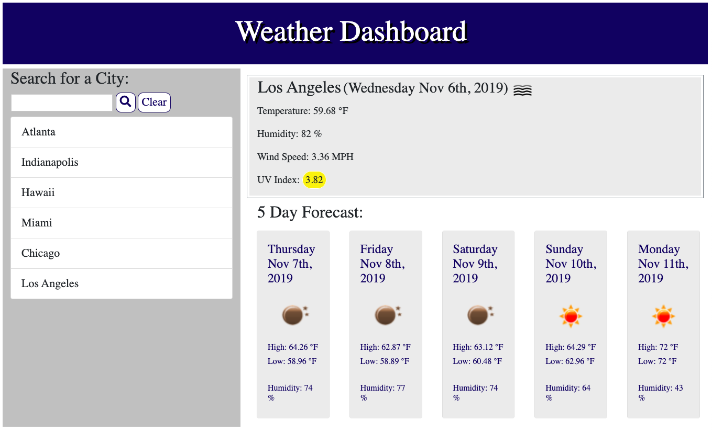

# Weather-Dashboard

This is your standard weather dashboard application. You can search any city and it will show you the current weather, as well as a 5 day forecast. I would like to eventually add geo location services to this application and possibly add some aimations in the future.

## Javascript, CSS. Bootstrap

## API's 
Open weather   
Moments.js

## Deployed URL

[Weather-Dashboard](https://jordancley.github.io/Weather-Dashboard/)

## Author

* **Jordan McQuiston** 